

<h1 align="center">ScipIO</h1>
<h5 align="center">Обучающий телеграм бот</h5>

## Оглавление
- [Описание](#Описание)
- [Инструменты](#Инструменты)
- [База Данных](#База_Данных)
  - dp_control
- [Flashcards](#Flashcards)
- [Category math](#Category_math)
- [Mentaly math](#Mentaly_math)
- [Timer](#Timer)
- [Statistics](#Statistics)
- [admin](#admin)
- [Дополнительное](#Дополнительное)
- [Установка](#Установка)
- [Полезные ссылки](#Полезные_ссылки)
- [Благодарности](#Благодарности)
- [Заключение](#Заключение)

## Описание

Scipio - это telegram-bot, который позволяет пользователям решать задачи по математике, логике, создавать свои собственные карточки - в общем, обучаться.

В боте представленны следующие алгоритмы:

1. **Mentally_math(ment_math)** - Математические примеры для подсчёта в уме.
   
2. **Categoty_marh(cat_math)** - Математические задачи. Категории (Алгебра, Текстовые задачи, Тригонометрия, Вероятность и т.д)
   
3. **Category_logic(cat_logic)** - Задачи на логику (данетки, загадки, логические задачи)
   
4. **Flashcards(flc)** - Пользовательские карточки для обучения

5. **Timer** -Пользовательское время для напоминания от бота о тренировках (flc, cat_math, cat_logic, ment_math)
   
6. **Statistics(stat)** - пользовательская статистика

7. **Admin** - просмотри статистики о количестве пользователей для администраторов

# Инструменты

- **aiogram - основной инстумент для разработки**
- sqlite - бд
- matplotlib - для графиков
- APScheduler - для таймера
- PIL - для рисования flc
- BeautifulSoup - для парсинга задач

## База Данных
### База данных состоит из:

| Таблица  | Описание |
| ------------- | ------------- |
| actions | Таблица действий пользователя. Например при выполнение flc, выполняется функция *action_add(message.from_user.id, 'flc')*, которая добавляет данные в таблицу |
| category | Категории заданий  |
| flashcards |Карточки пользователей |
| task_logic | Задачи по категории логика  |
| task_math | Задачи по категории математика  |
| time | Таймера пользователей |
| users | Все пользователи, пользующиеся ботом  |

### Структура самих таблиц:

1. **actions** 

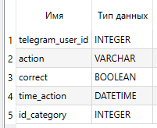

2. **category** 

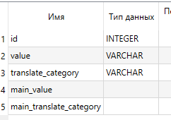

3. **flashcards** 

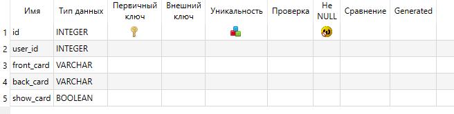

4. **task_math** (и в task_logic одинаковые структруры)

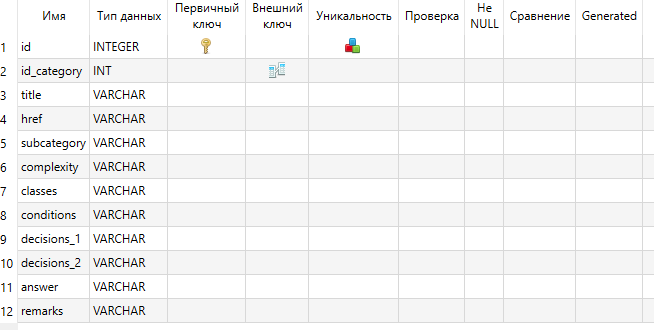

5. **time**

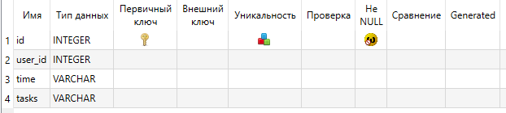

6. **Users**

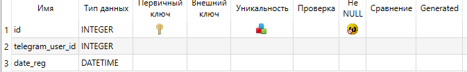

> **Почему у нас есть 2 одинаковые по стоению таблицы task_logic и task_math?**   
> Потому что таким образом мы решили отделить задачи разных алгоритмов. Это намного удобнее, чем хранить все в одной таблице.

### dp_control

Все функции для работы с бд хранятся в данном файле. Файл имеент чёткую иерархию:

## Flashcards
Суть данной алгоритма заключаеться в том чтобы создавать карточки и в будующем проходить их. 

Основная идея данного алгоритма в том, что из-за того что всё происходит в основной функции, то при нажатии "Правильно" и "Неправильно" следующее что делает функция fls_game, это создаёт новую flashcard и вызывает саму себя. Из-за этого алгоритм после "Правильно"/"Неправильно" сразу создаёт новую flashcard и показывает её, не требуя ввести сообщение от пользователя.

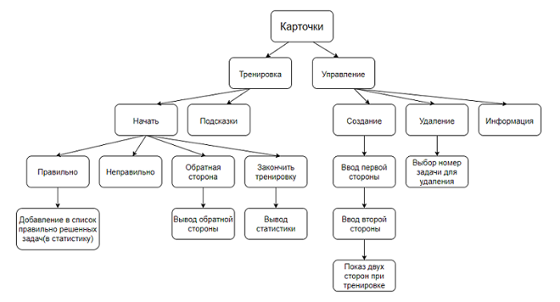

**Основной алгоритм.** Функция гененирует карточку, присылает пользователю фото карточки и создаёт кнопки, а дальше вызывает саму себя, и ждёт следующих действий от пользователя:

1. *"Обратная сторона".* Тогда вызывается функция (flc_game_reverse_side), которая срабатывает
                поверх функции flc_game. Она отправляет пользователю обратную сторону карточки и выключается, STATE оно не меняет!
                (flc_game) дальше ждёд действий от пользователя.

2. "Правильно" или "Неправильно". При нажатии на кнопку "Правильно" - пользователю при прохождении дальнейшей тренировки больше не будет высвечиватся это карточка (карточка удаляется из user_data['flashcards']). При нажатии на "Неправильно" - эта карточка при тренировке ещё БУДЕТ показываться

3. *"Закончить"*. Вызывает функцию (flc_game_end), которая присылвает статистику пользователю и соответственно
                заканчивает тренировку.

Статистика: 

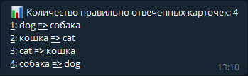

## Category math
Основная идея алгоритма в том чтобы отправлять задачи пользвателю после того как он нажмет "Правильно" или "Неправильно".

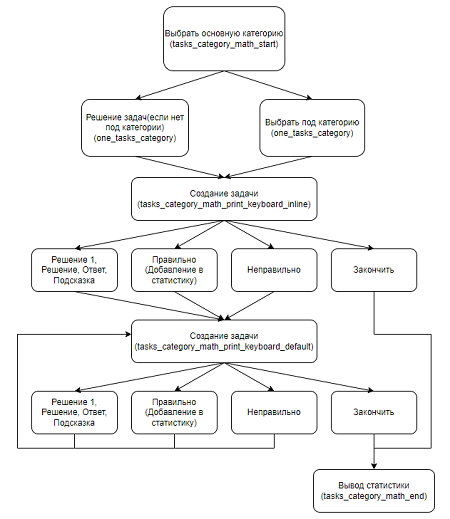

Сначал пользователю выберает основной категории (tasks_category_math_start), после пользователь может выбрать подкатегорию(функция: one_tasks_category), если подкатегории нет, то пользователю сразу присылется задача.

Основной алгоритм:

  1. Выбор основной категории. Функция: tasks_category_math_start
  2. Проверка есть ли подкатегория.
	* 2.1) Если подкатегории нет, то задача отправляется сразу.

      Функция: tasks_category_math_print_keyboard_inline
     * 2.2) Если подкатегория есть, то пользователь выбирает подкатегорию. Функция: one_tasks_category
  3. После выбора подкатегории, пользователю отправляется первая задача. Функция: tasks_category_math_print_keyboard_inline
  4. Когда пользователь ответит "Правильно" или "Неправильно" то вызывается функция: tasks_category_math_print_keyboard_default
  5. Чтобы закончить решение задач, пользователь может в боте нажать на кнопку "Закончить математикут.
  6. После того как пользователь закончил тренировку, ему высылается статистика:

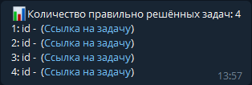

Были созданы две функции по отправке задач.

- *Первая функция* - tasks_category_math_print_keyboard_inline, отправляет задачу после нажатия на инлайн кнопку выбора категории.
- *Вторая функция* - tasks_category_math_print_keyboard_default, отправляет задачу после нажатия на кнопки: "Правильно", "Неправильно"

Эти две функциии очень схожи, разница только в запуске этих функций.
Подробное описание работы данных функций

Из базы данных рандомно выбирается задача. После этого создается сообщение в котором будет: id или название задачи, ссылка на задачу, подкатегория, сложность, для каких классов эта задача. 
Если это сообщение создается без ошибки то пользователю отправляется это сообщение, при ошибке эта задача автоматически удаляется из базы данных и пользователя предупреждают об ошибке. 

## Mentaly math
Основной алгоритм очень схож с (flashcards_training), но у него есть некоторое отличие.Так как тут требуется постоянно проверять ответ ввод пользователя из за этого алгоритм выглядит следующим образом. Есть вводная функция (equation_mentally_beginning), которая:
    
1. Проверяет, что написали "Да" (пользователь готов к тренировке)
2. Создаёт user_data (в которой храниться: условие, ответ, количество попыток)
3. Создаёт пример и создаёт вход в главную функцию (equation_mentally)

Потом уже функция (equation_mentally), генерирует примеры; отсекает неправильные варианты; и вызывает САМУ СЕБЯ.

**Работа основного алгоритма(equation_mentally):**
Сначала введенное значение проверяется на то что оно является числом. После этого проверяется ввденный ответ с правильным.Это делается с помощью state в который мы ранее записали условие ответ и количество попыток. Елси пользователь ответит более 3 раз неверно, то ему предлагается прочитать подсказки(/mell_theory). Когда пользовтель решит закончить тренировку ему присылается статистика: 

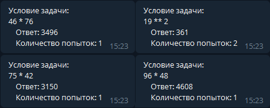

## Timer
Алгоритм таймера работает следующим образом:
Раз в 60 секунд запускается проверка, есть ли данное время (например 16:03) в базе данных time и если есть то выводит "Ежедневное задание" для пользователя. Пока она ждёт, она работает ассинхронно, поэтому ничего просто так не стоит.

> **Почему мы пользуемся библиотекой apscheduler, если мы просто вручную можем прописать `asyncio.sleep(5)`?**

> Это необходимо для того, чтобы одновременно с запуском бота запускался ассинхронный таймер, иначе приходиться запускать таймер вручную с помощью команды (в одной из первых версий бота, был реализован такой 'плохой' таймер, вы можете посмотреть на него в версии *d2ab674090b93ed318933e69b95c612a3423dd4a*)

## Statistics

Статистика пользоватлей сделанна так:

- В таблицу actions добавляются действия пользователя, такие как  flc, cat_math, cat_logic, ment_math
  
- Пользователь запускает /statistics, которое показывает:
  -  Количество показов flc, cat_math, cat_logic, ment_math пользователя за всё время
  -  Составляет круглую диаграмму по данным выше. Функция `pie_chart` 
  
    
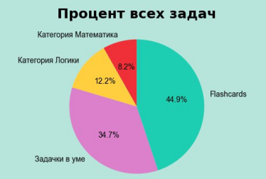

  -  Составляет диаграмму bar действий разных типов actions пользователя за неделю
    
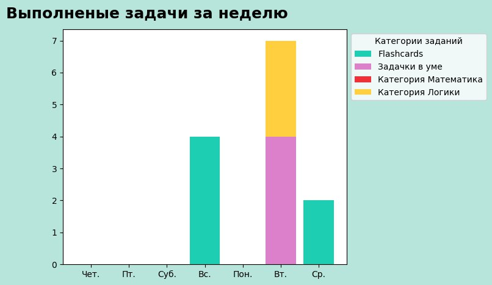

  

Все диаграммы реализованны с помощью matplotlib.

## admin

Данный алгоритм имеет функционал:

1. **Отправка сообщения всем пользователям**. Алгоритм отправляет определённое сообщение, которое потом циклом (с задержкой 0.1 секунда, это сделанно навсякий случай) отправляется каждому пользователю таблицы *Users*.
   
3. **Показ статистики о всех и о новых пользователях за определённое время**. Алгоритм реалезован также с помощью таблицы users, которая сохраняет дату регистрации пользователя в бд.

## Дополнительное

### register_cmd
Чтобы в файле main не прописывать каждый  `register_handler`, все данные функции вынесены в одельный файл.

### Антифлуд
Отличается от официального [aiogram примера](https://docs.aiogram.dev/en/latest/examples/middleware_and_antiflood.html), только лишь тем, что, если сообщение отправленно меньше, чем за 1 секунду, то пользователь блокируется ровно на 5 секунд.

## Установка
Для начала вам потребуется получить bot api от **@BotFather**.

После чего вам нужно будет создать файл **config** в который вы поместите bot api и id админов телеграм бота.

Для запуска бота вам нужно будет его скачать с [нашего github](https://github.com/AndrewKentavr/ScipIO). Можно скачать zip файл и распаковать его, или вы можете сделать forc таким образом скопировав наш репозиторий себе. 

**Config:**

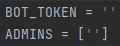

## License
Распростаняеться по лицензии GPLv3. Откройте LICENSE для получения допольнительной информации.

## Полезные ссылки

Есть список полезных ссылок от официального [aiogram](https://telegra.ph/aiogram-ru-01-28) сообщества и от [MasterGroosha](https://telegra.ph/faq-02-07-6)

- [Вводная статья на хабре про ботов](https://habr.com/ru/post/543676)
- [Отличная статья про многопоточность и многопроцессорность на анг](https://www.geeksforgeeks.org/difference-between-multithreading-vs-multiprocessing-in-python)
- [Официальная документация про многопот. и многопроц.](https://docs.python.org/3/library/multiprocessing.html?source=post_page-----48b59bfcc89e----------------------)
- [Парсинг сайтов на Python: подробный видеокурс ](https://www.youtube.com/watch?v=AFqYxaOyqy0&list=PLqGS6O1-DZLprgEaEeKn9BWKZBvzVi_la)
- [Асинхронность в Python](https://botfather.dev/blog/async-in-python#asyncio-lib)
- [Асинхронное программирование в Python: краткий обзор](https://habr.com/ru/company/ruvds/blog/475246)
- [Учебник по git](https://githowto.com/ru)

#### **Aiogram**:
- [Mastergroosha - лучшая статья](https://mastergroosha.github.io/telegram-tutorial-2)
- [Плейлист tutorial по aiogram (Physics is Simple)](https://www.youtube.com/watch?v=wj1Vwq3IrL4&list=PLwVBSkoL97Q3phZRyInbM4lShvS1cBl-U)
- [Официальные примеры aiogram docs](https://docs.aiogram.dev/en/latest/examples/index.html)
- [Как сделать функции таймера в боте](https://botfather.dev/blog/zapusk-funkczij-v-bote-po-tajmeru)

#### Чаты 
- [Официальный чат aiogram](https://t.me/aiogram_ru), где сидит главный разработчик
- [Чат MasterGroosha](https://t.me/joinchat/TsftDfnevFLQS1ts)

## Заключение

Отдельно хочется выразить благорарность MasterGroosha и сообществу aiogram, без них этого проекта не было бы.

- Андрей Тощаков - создатель проекта, основной разработчик (ник в telegram: @Endrey_k)
- Ахмед Шагбанов - основной разработчик (ник в telegram: @ShagbanovAhmed)
  
По всем вопросам можете писать или AndrewKentavr или MrDoberman